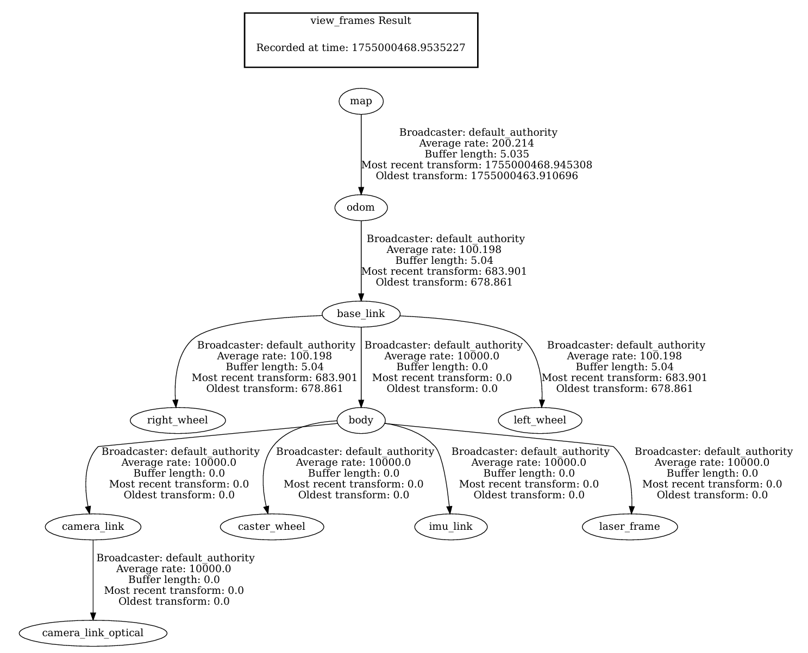

# ROS2 Mobile Robot Perception & Control

A ROS 2 (Humble) workspace for **mobile robot perception-driven control**:
OpenCV/YOLO-based tracking → FSM/BT/PID control → navigation/patrol utilities.

This repository is organized as a single workspace (`src/`) to make the code easy to review.

## Highlights

### Perception
- Color / object tracking nodes (OpenCV)
- YOLO marker publishing for visualization / downstream control

### Behavior & Control
- Finger-gesture based FSM control
- PID control utilities
- Behavior Tree (BT) practice

### Navigation / Mission
- Simple patrol / planner modules
- TurtleBot3 teleop / cmd_vel utilities (as needed)

